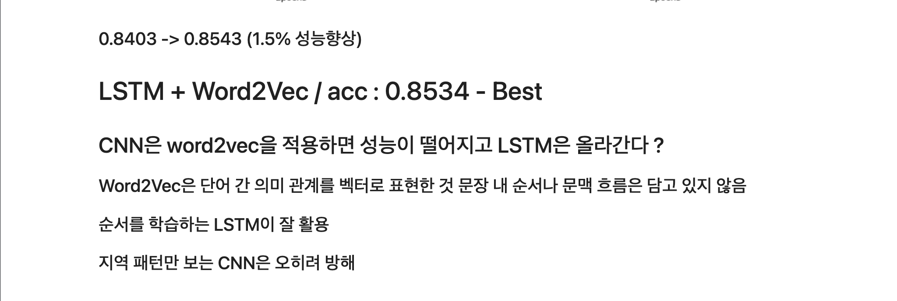
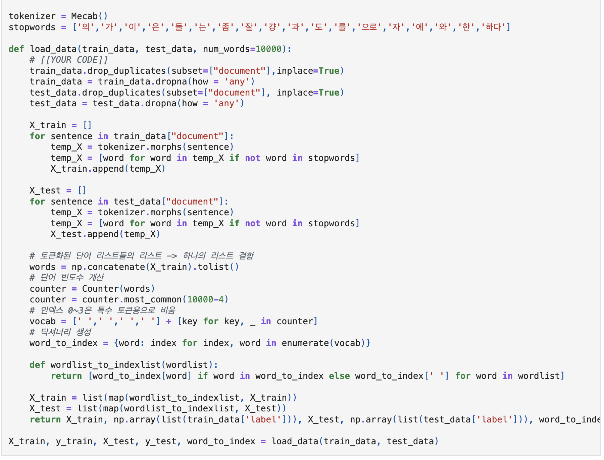
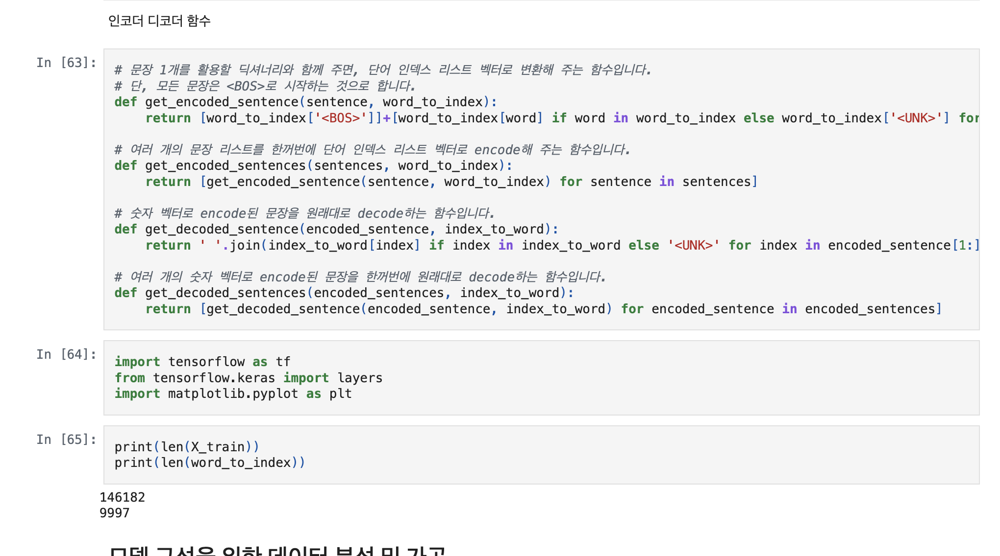
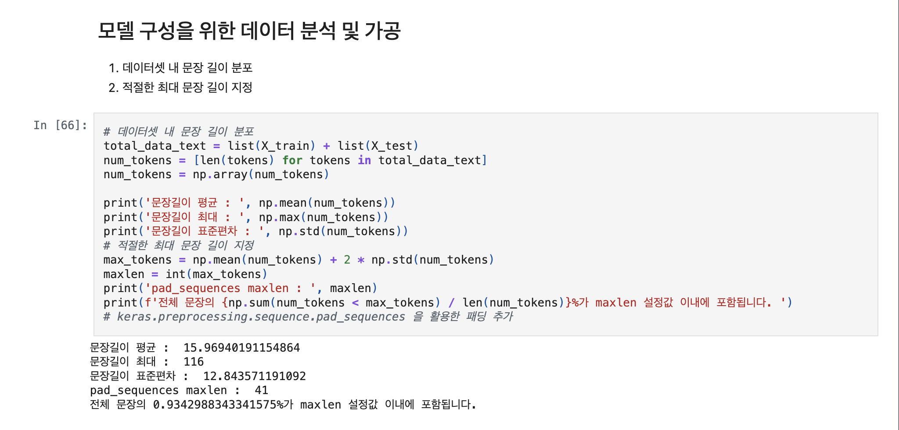
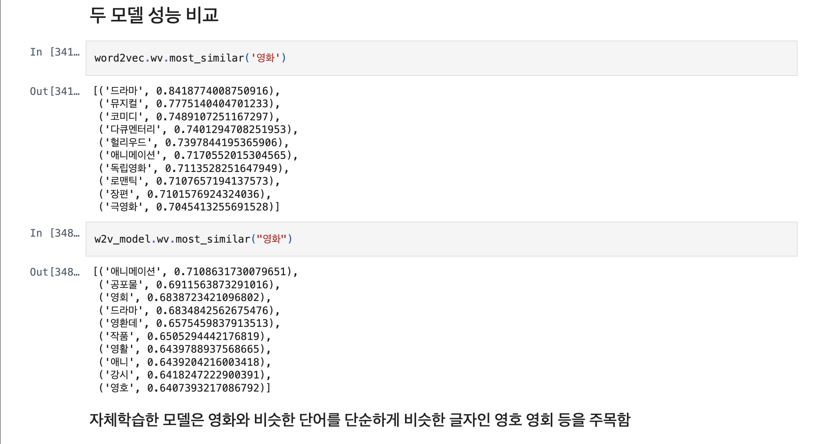
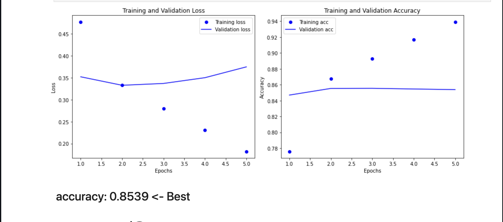
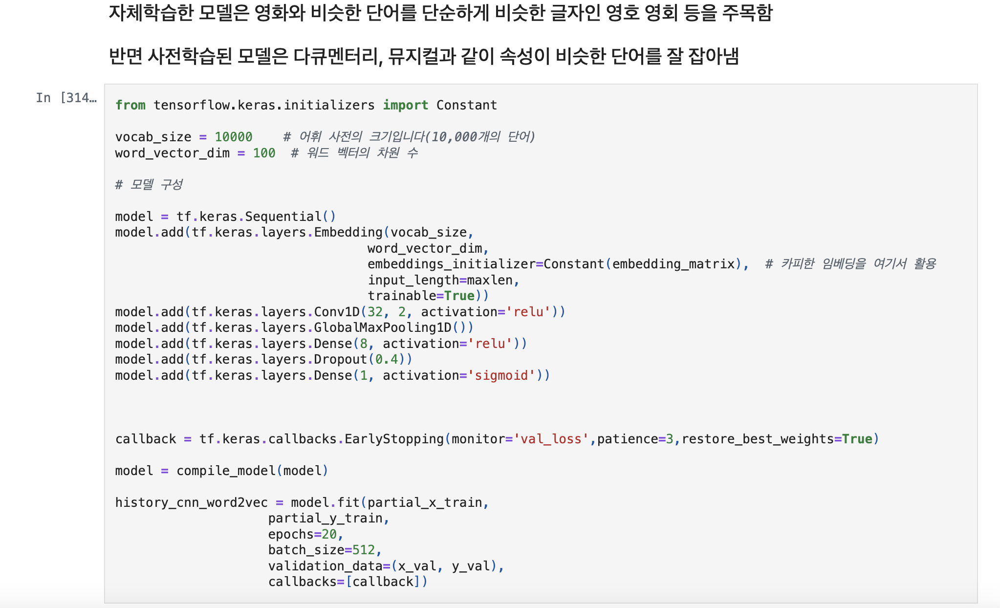
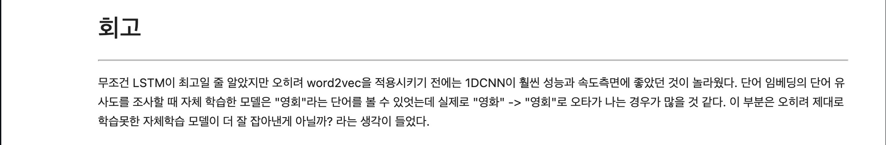
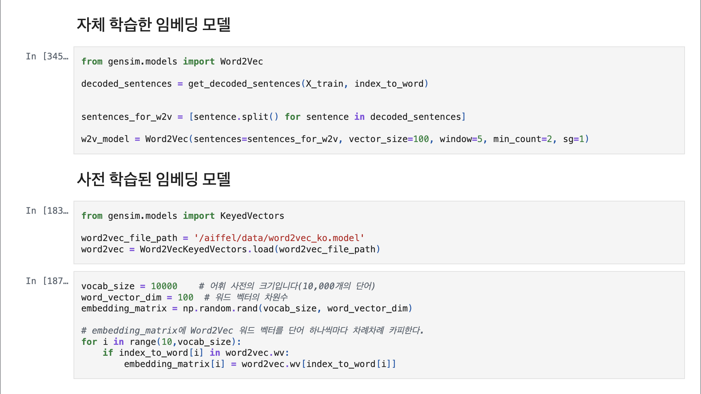

# AIFFEL Campus Online Code Peer Review Templete
- 코더 : 김청해
- 리뷰어 : 신기성


# PRT(Peer Review Template)
- [ ]  **1. 주어진 문제를 해결하는 완성된 코드가 제출되었나요?**
    - 네 주어진 문제를 해결하는 완성된 코드가 제출 되었습니다.
        
    
- [ ]  **2. 전체 코드에서 가장 핵심적이거나 가장 복잡하고 이해하기 어려운 부분에 작성된 
주석 또는 doc string을 보고 해당 코드가 잘 이해되었나요?**
    - 전체 코드에서 가장 핵심적인 부분은 가장 초반에 우리가 tokenize 시켜주는 부분인것 같습니다. 어떻게 토큰화 시켜서 train 과 test 셋을 구분 하고 진행할지에 대한 부분이 가장 복잡하고 이해하기 어려운 부분이엇을것 같고 해당 코드 블럭에 이해를 돕기위해서 doc string/annotation 달려있는것을 확인하였고,
주석과 코드등을 잘 적어서 이해하기가 어느정도 수월 했던 것 같습니다. 
        
        
- [ ]  **3. 에러가 난 부분을 디버깅하여 문제를 해결한 기록을 남겼거나
새로운 시도 또는 추가 실험을 수행해봤나요?**
    - 네 문제원인 및 해결과정등을 잘 서술 하였고, 프로젝트 평가기준에 더해 추가적으로
 수행한 시도가 있었습니다.
 또한 각각의 실험들이 기록 되어 있고 각각에대한 설명이 너무 좋았던것 같습니다.
        
	
	
	
	
        
- [ ]  **4. 회고를 잘 작성했나요?**
    - 네 주어진 문제에 대한 회고가 정말 잘 작성되었습니다. 
    	
        
- [ ]  **5. 코드가 간결하고 효율적인가요?**
    - 네 파이썬 스타일 가이드를 준수 하였습니다.
    - 네 코드 중복을 최소화 하였고, 깔끔하게 정리 하는 코드 스타일을 보여줍니다.
        


# 회고(참고 링크 및 코드 개선)
```
# 리뷰어의 회고를 작성합니다.
# 다양한 방법을 활용하여 accuracy 와 loss의 차이를 보여주었고, convolution을 사용해서 
cost effective 한 방법론을 제시해주신것 같습니다. 
```
