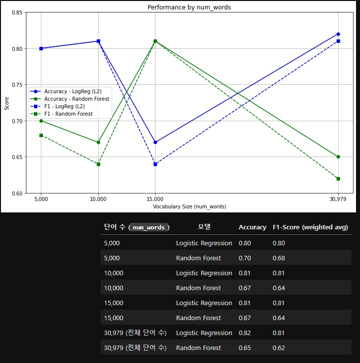
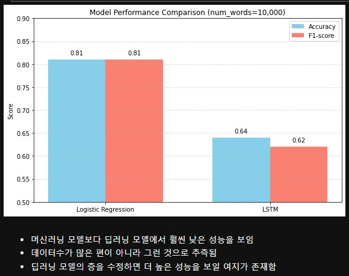
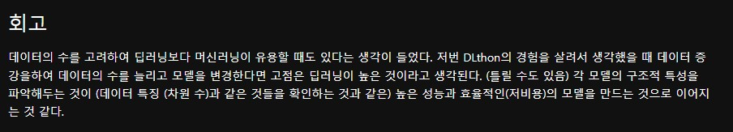

# AIFFEL Campus Online Code Peer Review Templete
- 코더 : 김청해
- 리뷰어 : 김범모

# PRT(Peer Review Template)
- [ O ]  **1. 주어진 문제를 해결하는 완성된 코드가 제출되었나요?**
      - 
  
        num_words를 5000, 10000, 15000, None으로 설정하여 실험을 진행하였습니다.
    
- [ O ]  **2. 전체 코드에서 가장 핵심적이거나 가장 복잡하고 이해하기 어려운 부분에 작성된 
주석 또는 doc string을 보고 해당 코드가 잘 이해되었나요?**

      - 주석과 코드 설명이 있어서 잘 이해되었습니다.
        
- [ O ]  **3. 에러가 난 부분을 디버깅하여 문제를 해결한 기록을 남겼거나
새로운 시도 또는 추가 실험을 수행해봤나요?**
    - 
      
    - LSTM 모델을 학습하여 성능이 좋았던 Logistic Regression과 비교하였습니다.
        
- [ O ]  **4. 회고를 잘 작성했나요?**
     
     
        
- [ O ]  **5. 코드가 간결하고 효율적인가요?**
  
    - 네 필요한 코드가 간결하게 작성되었습니다.
    

# 회고(참고 링크 및 코드 개선)
모델 성능을 그래프로 그려주셔서 모델 비교하기 좋았고, 실험마다 실험 결과를 바로 마크다운으로 정리해주셔서 보기 편했습니다!
